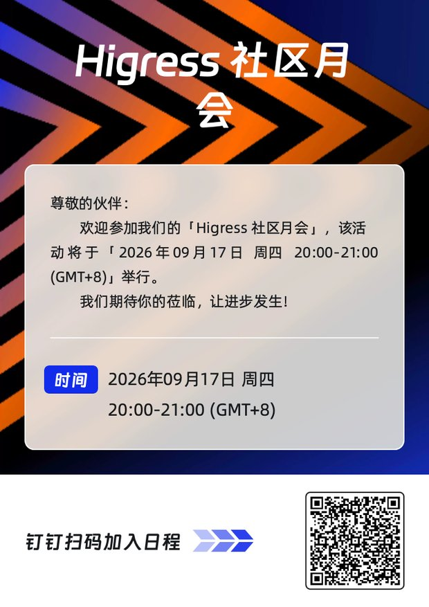

# Higress Community Meetings

Higress community meetings are open to users, contributors, and anyone
interested in the project. We share project updates and discuss technical
topics and future work.

## Schedule and joining

| Item | Details |
| --- | --- |
| Meeting | Higress Community Meeting |
| Schedule | Monthly, on the third Thursday |
| Time | 20:00 to 21:00 Asia/Shanghai (UTC+8) |
| Upcoming meetings | [Higress meetings on the LFX platform](https://zoom-lfx.platform.linuxfoundation.org/meetings/higress) |
| Join via Zoom | [Higress Community Meeting page](https://zoom-lfx.platform.linuxfoundation.org/meeting/94551670181?password=6b1f20d7-7b52-4a32-86fe-5a32de2ee879) |
| DingTalk calendar | Scan the poster or QR code below with DingTalk to add the meeting to your calendar |

The meeting runs on Zoom and DingTalk at the same time. Join through whichever
platform is more convenient for you.

This is a recurring monthly meeting. The LFX calendar lists upcoming dates and
any schedule changes. Select a meeting on the calendar to join via Zoom. No
project invitation is required, and participants may join up to 10 minutes
before the scheduled start.

The DingTalk poster is updated for each meeting and is also posted in the
corresponding agenda issue before the meeting.

## Agenda and participation

Before each meeting, maintainers open a public GitHub issue named
`[Community Meeting] YYYY-MM-DD` for the agenda and meeting record. Anyone may
propose a topic by commenting on that issue. Agenda issues can be found in the
[community meeting issue archive](https://github.com/higress-group/community/issues?q=is%3Aissue+%22%5BCommunity+Meeting%5D%22).

Each agenda issue records:

- the meeting date, time, calendar entry, and joining link;
- proposed topics, their proposers, and relevant issue or pull-request links;
- discussion notes, decisions, and action items with owners; and
- the recording and transcript links after they become available.

After each meeting, maintainers publish the final record under
[`meetings/YYYY/YYYY-MM-DD.md`](./meetings/README.md) and link it from the
agenda issue.

Participants who cannot attend may comment on the agenda issue before or after
the meeting. Significant technical or governance decisions are finalized and
recorded in the relevant public issue or pull request so that meeting
attendance is not required to participate in project decisions.

## Recordings and notes

The LFX meeting is configured for recording and transcription. After LFX has
processed a meeting, the public recording and transcript are linked from the
calendar event, final meeting record, and agenda issue. The
[`meetings`](./meetings/README.md) directory is the durable archive for notes,
decisions, action items, and related project discussions.

All participants must follow the project
[Code of Conduct](./CODE_OF_CONDUCT.md). Confidential security reports and
Code of Conduct incidents are not discussed in the public meeting; use the
private channels documented in [`COMMUNITY.md`](./COMMUNITY.md) instead.
