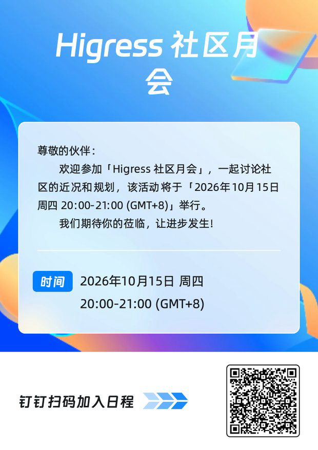

# Higress Community Meetings

Higress community meetings are open to users, contributors, and anyone
interested in the project. We share project updates and discuss technical
topics and future work.

## Schedule and joining

| Item | Details |
| --- | --- |
| Meeting | Higress Community Meeting |
| Schedule | Monthly, on the third Thursday |
| Time | 20:00 to 21:00 Asia/Shanghai (UTC+8) |
| Platform | DingTalk |
| DingTalk calendar | [Open the recurring Higress Community Meeting event](https://n.dingtalk.com/dingding/calendar/detail/index.html?dd_full_screen=true&dd_progress=false&dd_darkmode=true&dd_android_full=true&uniqueId=cklhN1hyM1VLYnVjYlg3ZG5yU3J5dz09&recurrenceId=1792065600000&corpId=dingd8e1123006514592&inviterId=RWlWYkUwK1ZUakZHclB0VlBHUHJpZz09) |
| Next meeting | October 15, 2026, 20:00 to 21:00 Asia/Shanghai (UTC+8) |

Higress community meetings are held on DingTalk. Open the calendar link above
on a device with DingTalk installed, or scan the QR code in the poster below,
to add the recurring meeting and receive future updates.

Meetings through August 2026 used LFX Zoom. To make it easier for developers
to join, Higress moved its community meetings to DingTalk starting in September
2026. Historical meeting records retain the platform and joining links used at
the time.

This is a recurring monthly DingTalk event with no scheduled end date. Any
schedule changes are reflected in the DingTalk calendar and announced in the
corresponding public agenda issue.

The DingTalk poster is updated for each meeting and is also posted in the
corresponding agenda issue before the meeting.

## Agenda and participation

Before each meeting, maintainers open a public GitHub issue named
`[Community Meeting] YYYY-MM-DD` for the agenda and meeting record. Anyone may
propose a topic by commenting on that issue. Agenda issues can be found in the
[community meeting issue archive](https://github.com/higress-group/community/issues?q=is%3Aissue+%22%5BCommunity+Meeting%5D%22).

Each agenda issue records:

- the meeting date, time, calendar entry, and joining link;
- proposed topics, their proposers, and relevant issue or pull-request links;
- discussion notes, decisions, and action items with owners; and
- the recording and transcript links after they become available.

After each meeting, maintainers publish the final record under
[`meetings/YYYY/YYYY-MM-DD.md`](./meetings/README.md) and link it from the
agenda issue. The final record keeps the original outline as a source link and
separately records the meeting minutes, conclusions, decisions, and action
items.

Participants who cannot attend may comment on the agenda issue before or after
the meeting. Significant technical or governance decisions are finalized and
recorded in the relevant public issue or pull request so that meeting
attendance is not required to participate in project decisions.

## Recordings and notes

The [`meetings`](./meetings/README.md) directory is the durable public archive
for notes, decisions, action items, and related project discussions. When a
public recording or transcript is available, it is linked from the final
meeting record and agenda issue.

All participants must follow the project
[Code of Conduct](./CODE_OF_CONDUCT.md). Confidential security reports and
Code of Conduct incidents are not discussed in the public meeting; use the
private channels documented in [`COMMUNITY.md`](./COMMUNITY.md) instead.
