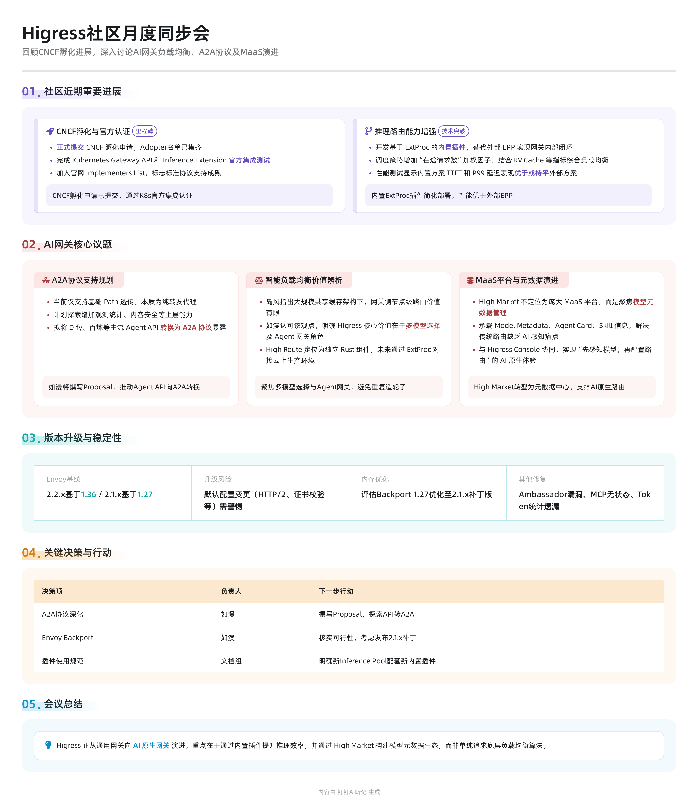

# Higress Community Meeting - 2026-09-17

- **Time:** 20:00 to 21:00 Asia/Shanghai (UTC+8)
- **Calendar:** [Recurring DingTalk calendar event](https://github.com/higress-group/community/blob/main/MEETINGS.md#schedule-and-joining)
- **Meeting platform:** DingTalk
- **Source notes:** [DingTalk meeting notes](https://alidocs.dingtalk.com/i/nodes/14lgGw3P8vxjwogPCZG59BonV5daZ90D)

## Meeting outline

The complete meeting outline, proposal inventory, benchmark tables, and
configuration examples are maintained in the original
[DingTalk meeting document](https://alidocs.dingtalk.com/i/nodes/14lgGw3P8vxjwogPCZG59BonV5daZ90D).
This record links to that source rather than duplicating or re-summarizing the
outline.

## Meeting minutes and conclusions

### Meeting context

The monthly meeting reviewed the previous month's community progress,
including the CNCF Incubation application, release and stability work, and
Kubernetes standards integration. The main discussion focused on AI gateway
architecture: A2A protocol support, inference load balancing, intelligent model
routing, Sandbox integration, and the evolution of the HiMarket metadata
service.

### Recent community progress

- Higress formally submitted its
  [CNCF Incubation application](https://github.com/cncf/toc/issues/2291). The
  previously missing adopter list has been collected, and the application is
  in review.
- Following the 2.2.4 release, Higress completed the relevant Kubernetes
  Gateway API and Gateway API Inference Extension integration tests and was
  added to both official implementation lists:
  [Gateway API](https://gateway-api.sigs.k8s.io/docs/implementations/list/#higress)
  and [Inference Extension](https://gateway-api-inference-extension.sigs.k8s.io/implementations/gateways/#higress).
- The community developed a built-in endpoint picker to replace the separate
  external EPP deployment and close the routing and data-plane control loop
  inside the gateway. Endpoint scoring combines queued requests, KV-cache
  utilization, prefix-cache matching, and gateway-local in-flight requests.
- In the recorded 40-concurrency benchmark, the built-in picker reduced mean
  time to first token from 311.63 ms with round-robin to 214.42 ms and raised
  token throughput from 489.71 to 565.65 tokens per second. At concurrency 20,
  the external EPP was slightly better in the recorded multi-turn workload, so
  the results remain workload-dependent. Detailed data is available in
  [#4352](https://github.com/higress-group/higress/pull/4352).

### A2A and Agent gateway direction

- The current A2A implementation provides the protocol-proxy foundation,
  including JSON-RPC and SSE forwarding, protocol validation, trusted metadata
  extraction, and Agent Card validation and rewriting. At this stage it is
  primarily a forwarding proxy.
- The proposed next step is to add gateway-level observability,
  authentication, and content-safety capabilities, and to explore adapting
  established Agent APIs such as Dify, AgentScope, and Model Studio to A2A.
  This would reduce the need for every upstream Agent implementation to adopt
  an A2A SDK directly.
- Schema conversion is expected to be extensible through Wasm so that the
  gateway can provide a common Agent-facing proxy while retaining custom
  protocol mappings.

### AI load balancing and routing architecture

- AI Endpoint Picker and the earlier AI Load Balancer both address
  inference-pool endpoint selection. The endpoint picker follows the
  Gateway API Inference Extension model and combines several scheduling
  signals, while the earlier plugins expose more individual capabilities.
- The discussion noted that gateway-side node selection has less value in
  large deployments that already use shared caches and high-bandwidth
  infrastructure. Higress remains valuable for smaller deployments, routing
  across multiple models, and its broader Agent gateway role.
- [HiRoute](https://github.com/higress-group/HiRoute) is an independent Rust
  routing component for adaptive model selection. The planned integration uses
  ExtProc so that HiRoute can provide model-selection decisions to Higress in
  production environments.
- Sandbox systems commonly include their own lifecycle manager and router.
  Higress can currently provide an upper-layer Ingress or Gateway API
  integration, but deeper lifecycle integration needs further investigation.

### Version upgrades and stability

- Higress 2.2.x uses Envoy 1.36, while the 2.1.x line uses Envoy 1.27.
  Upgrading can expose default-behavior and compatibility changes around
  HTTP/2, certificate validation, Envoy APIs, and Istio configuration.
- The meeting raised a possible backport of Envoy 1.27 memory optimizations to
  a Higress 2.1.x patch release for users who cannot yet upgrade. The exact
  changes and community-policy implications still need verification.
- Other reviewed work included security updates, MCP stateless-protocol
  compatibility, and fixes for token-accounting loss when streaming response
  events are split across network chunks.

### HiMarket and model metadata

- The discussion proposed narrowing HiMarket from a broad MaaS platform to a
  metadata service for model metadata, Agent Cards, and Skill information.
- Combined with the Higress Console, this metadata can support an AI-native
  workflow in which users discover models first and then configure intelligent
  routing through components such as HiRoute.

### Overall conclusion

Higress is evolving from a general-purpose API gateway toward an AI-native
gateway. The community will continue improving inference efficiency through
the built-in endpoint picker while investing in multi-model selection, Agent
protocol mediation, and a model-metadata ecosystem rather than focusing only
on node-level load-balancing algorithms.

## Decisions

- Explore converting established Agent APIs to A2A and using Wasm for custom
  schema conversion, extending the current A2A forwarding proxy with unified
  authentication and observability.
- Evaluate whether the relevant Envoy 1.27 memory optimizations can be safely
  backported to a Higress 2.1.x patch release.
- Document that InferencePool-based deployments should use the new built-in
  endpoint picker and should not mix it with legacy atomic AI load-balancing
  plugins that could create conflicting configuration.

## Action items

- [ ] Draft a Proposal for converting common Agent APIs to A2A and define the
  extensible schema-conversion approach. Owner: @EndlessSeeker.
- [ ] Identify the Envoy 1.27 memory optimizations missing from Higress 2.1.x,
  verify backport feasibility and community-policy compliance, and decide
  whether to prepare a patch release. Owner: @EndlessSeeker.
- [ ] Update inference-routing documentation to pair InferencePool with the
  built-in endpoint picker and explain incompatible legacy plugin
  combinations. Owner: Higress documentation maintainers.

## Recording and transcript

- **Recording:** Not available in the source notes.
- **Transcript:** Not available; the DingTalk source notes are linked above.
